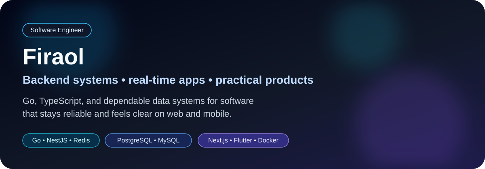
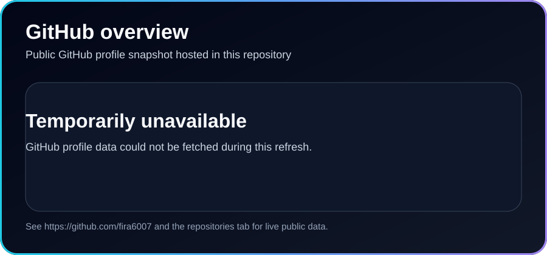
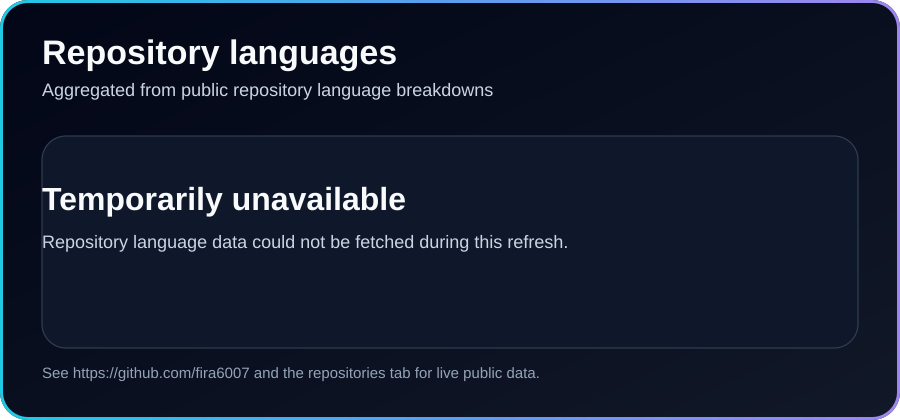
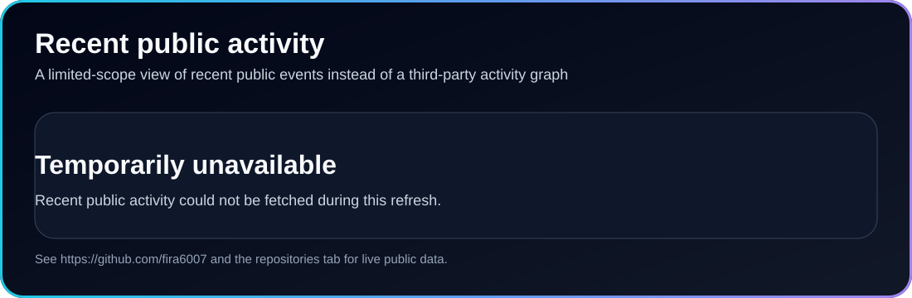

  

  
  

  <a href="https://www.linkedin.com/in/firaol-abera-382b18298/">LinkedIn</a> · <a href="https://github.com/fira6007?tab=repositories">Repositories</a>

  <strong>Software Engineer · Fourth-year Software Engineering student</strong> 
  Resilient systems, expressive interfaces, and software built for concrete local needs.

## 👋 About Me

I’m Firaol, a software engineer and fourth-year Software Engineering student driven by a simple principle: the best software is resilient, technically sound, and useful in the real world. My work gravitates toward backend architecture, distributed systems, and real-time applications, but I’m comfortable across the stack—from relational data design and API contracts to polished web and mobile experiences.

I enjoy engineering systems that stay predictable when the environment is not. That means thinking about erratic networks, transaction safety, queue backpressure, query behavior under load, and how client experiences stay responsive when the backend is doing serious work behind the scenes.

Away from the terminal, I bring the same mindset to chess. Endgame theory, tactical patterns, and rapid games keep me honest about patience, structure, and the long-term consequences of every move.

## 🧭 How I Engineer

- **Backend first, but not backend only:** I build event-driven services in **Go** and **NestJS**, and I care about clean boundaries between services, queues, and clients.
- **Data with discipline:** I rely on **PostgreSQL** and **MySQL** for dependable relational models, using transactions where consistency and recovery guarantees actually matter.
- **Realtime where it counts:** I use **Redis** and **WebSockets** for low-latency coordination, message flow, retries, and user-facing updates.
- **Thoughtful frontends:** With **Next.js**, **Flutter**, and **TypeScript**, I aim for interfaces that feel responsive, intuitive, and tightly connected to robust backend logic.
- **Transparent workflows:** My setup is **Ubuntu/Linux-first**, heavily terminal-driven, and shaped around **Docker**, reproducibility, reverse tunnels, and clear operational visibility.
- **AI with engineering judgment:** I use AI-assisted tools and local models for scaffolding, edge-case exploration, and architecture inspection—but never as a substitute for verification.

## 🌍 What I Build

My projects are rooted in utility and localized impact:

- **Campus information streams** that help important updates move quickly through high-traffic student environments.
- **Programmatic SMS dispatch gateways** with queueing and retry behavior for communication workflows that need to keep working when delivery is imperfect.
- **Digital showrooms for local hardware merchants** that make products easier to discover and easier to trust for businesses serving their communities directly.

I’m most motivated when software removes friction from real operational bottlenecks instead of adding more ceremony around them.

## 🛠️ Tech Stack

**Backend & APIs**  

**Data, caching & messaging**  

**Web & mobile**  

**Environment & workflow**  

## 📊 GitHub Snapshot

  
  

  

  
    Language data reflects public repository code, not proficiency. Activity is based on GitHub's recent public event feed and is not a complete contribution count.
    If an asset is temporarily unavailable, see my <a href="https://github.com/fira6007?tab=repositories">repositories</a> and
    <a href="https://github.com/fira6007">GitHub profile</a> directly.
  

## 🔄 Public Data Refresh

This profile now uses repository-hosted SVG cards refreshed by GitHub Actions with public GitHub data and the built-in `GITHUB_TOKEN`. That removes the broken dependency on third-party stats, language, activity, and trophy services while keeping the profile visually rich and honest about what each card actually measures. If a refresh fails, the workflow preserves the last good snapshot and the generator falls back to an explicit unavailable state instead of silently showing stale or broken embeds.
